**Final-year Computer Engineering student @ Başkent University ('26)** — building things in
edge AI optimization, embedded software and systems programming, primarily in **C, C++ and Python**.

---

## 🔭 Featured projects

| | |
|---|---|
| **[tinyml-keyword-spotting](https://github.com/KNCn23/tinyml-keyword-spotting)** End-to-end TinyML keyword spotting — log-mel features, a NumPy MLP, INT8 quantisation and a pure-C inference that matches it exactly | **[mini-tcp-stack](https://github.com/KNCn23/mini-tcp-stack)** A small, readable TCP/IP stack from scratch in C — Ethernet, ARP, IPv4, ICMP, TCP state machine, unit tests + Linux TAP demo |
| **[mini-rtos](https://github.com/KNCn23/mini-rtos)** AArch64 cooperative + preemptive RTOS — round-robin and priority scheduling, context switching, semaphores, on QEMU virt | **[aes-sca-sim](https://github.com/KNCn23/aes-sca-sim)** AES-128 side-channel attack simulator — synthetic power traces + Correlation Power Analysis key recovery |
| **[vehicle-routing-solver](https://github.com/KNCn23/vehicle-routing-solver)** Capacitated VRP / VRPTW solver built on Google OR-Tools — capacity, time windows, haversine maps, route plots | **[onnx-quant-benchmark](https://github.com/KNCn23/onnx-quant-benchmark)** FP32 / FP16 / INT8 ONNX model comparison for edge deployment — latency, size, accuracy across quantization modes |

… and more on <a href="https://github.com/KNCn23?tab=repositories">the repositories tab</a> or the <a href="https://kncn23.github.io">portfolio</a> — filterable by category.

## 🛠️ Tech stack

## 💼 Experience

**BİTES — Defence & Aerospace Technologies** · Intern · Jan – Feb 2025 · Ankara 
Researched and developed optimization techniques for edge AI within classical CNN algorithms. Focused on performance and efficiency improvements for edge-level inference in defense and aerospace applications.

**Meteksan Savunma** · Intern · Aug 2024 · Ankara 
Embedded software development in C, C++, and Python within a defense technology environment. Worked on software integration and deployment in embedded systems.

**Kodfu** · Intern · Jul – Aug 2023 · Ankara 
Software development with a focus on code quality, optimization, and team collaboration. Participated in code reviews and project delivery.

**Nomatto** · Intern · Jul – Aug 2023 
Software development and design; testing, debugging, and project documentation.

## 🎯 Areas of interest

| | |
|---|---|
| ⚙️ **Edge AI & Embedded Systems** CNN optimization, C/C++, embedded software development | 🧩 **Constraint Programming & Optimization** CP-SAT, Google OR-Tools, scheduling systems |
| 👁️ **Computer Vision** OpenCV, MediaPipe, augmented reality | 🌐 **Backend Development** FastAPI, Spring Boot, PostgreSQL |

## 📊 GitHub

---

🌐 [**kncn23.github.io**](https://kncn23.github.io) · [**LinkedIn**](https://www.linkedin.com/in/ata-kaan-can-olcay-0154a2208/) · ✉️ [**kaancanolcay@gmail.com**](mailto:kaancanolcay@gmail.com)

Portfolio is bilingual (EN / TR) — projects, experience and CV in both languages.

