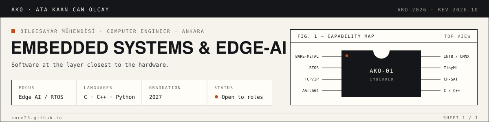

<a href="https://kncn23.github.io">
  <picture>
    <source media="(prefers-color-scheme: dark)" srcset="assets/banner-dark.svg">
    
  </picture>
</a>

**Final-year Computer Engineering student @ Başkent University ('27)** — building things in
edge AI optimization, embedded software and systems programming, primarily in **C, C++ and Python**.

---

## § 01 — Featured projects

| | |
|---|---|
| **[neo-swarm](https://github.com/KNCn23/neo-swarm)** · [live ↗](https://kncn23.github.io/neo-swarm/) The near-Earth asteroid swarm — 6,800+ real orbits from NASA/JPL SBDB, close-approach watch mode, discovery timeline, 41k real stars. Zero dependencies | **[movie-recommendation](https://github.com/KNCn23/movie-recommendation)** · [live ↗](https://kncn23.github.io/movie-recommendation/) CineMatch — content-based recommender over 9,500+ films (TF-IDF + cosine similarity), instant search, posters, genre browsing, EN/TR. Zero dependencies, fully static |
| **[tinyml-keyword-spotting](https://github.com/KNCn23/tinyml-keyword-spotting)** End-to-end TinyML keyword spotting — log-mel features, a NumPy MLP, INT8 quantisation and a pure-C inference that matches it exactly | **[mini-tcp-stack](https://github.com/KNCn23/mini-tcp-stack)** A small, readable TCP/IP stack from scratch in C — Ethernet, ARP, IPv4, ICMP, TCP state machine, unit tests + Linux TAP demo |
| **[mini-rtos](https://github.com/KNCn23/mini-rtos)** AArch64 cooperative + preemptive RTOS — round-robin and priority scheduling, context switching, semaphores, on QEMU virt | **[aes-sca-sim](https://github.com/KNCn23/aes-sca-sim)** AES-128 side-channel attack simulator — synthetic power traces + Correlation Power Analysis key recovery |
| **[vehicle-routing-solver](https://github.com/KNCn23/vehicle-routing-solver)** Capacitated VRP / VRPTW solver built on Google OR-Tools — capacity, time windows, haversine maps, route plots | **[onnx-quant-benchmark](https://github.com/KNCn23/onnx-quant-benchmark)** FP32 / FP16 / INT8 ONNX model comparison for edge deployment — latency, size, accuracy across quantization modes |

… and more on <a href="https://github.com/KNCn23?tab=repositories">the repositories tab</a> or the <a href="https://kncn23.github.io">portfolio</a> — filterable by category.

## § 02 — Tech stack

## § 03 — Experience

**BİTES — Defence & Aerospace Technologies** · Intern · Jan – Feb 2025 · Ankara 
Researched and developed optimization techniques for edge AI within classical CNN algorithms. Focused on performance and efficiency improvements for edge-level inference in defense and aerospace applications.

**Meteksan Savunma** · Intern · Aug 2024 · Ankara 
Embedded software development in C, C++, and Python within a defense technology environment. Worked on software integration and deployment in embedded systems.

**Kodfu** · Intern · Jul – Aug 2023 · Ankara 
Software development with a focus on code quality, optimization, and team collaboration. Participated in code reviews and project delivery.

**Nomatto** · Intern · Jul – Aug 2023 
Software development and design; testing, debugging, and project documentation.

## § 04 — Areas of interest

| | |
|---|---|
| **Edge AI & Embedded Systems** CNN optimization, C/C++, embedded software development | **Constraint Programming & Optimization** CP-SAT, Google OR-Tools, scheduling systems |
| **Computer Vision** OpenCV, MediaPipe, augmented reality | **Backend Development** FastAPI, Spring Boot, PostgreSQL |

## § 05 — GitHub

<picture>
  <source media="(prefers-color-scheme: dark)" srcset="https://github-readme-stats.vercel.app/api?username=KNCn23&show_icons=true&bg_color=14161a&title_color=e2763f&icon_color=e2763f&text_color=c9c3b8&border_color=33373e&rank_icon=github">
  
</picture>
<picture>
  <source media="(prefers-color-scheme: dark)" srcset="https://github-readme-stats.vercel.app/api/top-langs/?username=KNCn23&layout=compact&bg_color=14161a&title_color=e2763f&text_color=c9c3b8&border_color=33373e&langs_count=8">
  
</picture>

---

[**kncn23.github.io**](https://kncn23.github.io) · [**LinkedIn**](https://www.linkedin.com/in/ata-kaan-can-olcay-0154a2208/) · [**kaancanolcay@gmail.com**](mailto:kaancanolcay@gmail.com)

AKO-2026 · REV 2026.10 · Ankara, Türkiye — portfolio is bilingual (EN / TR)

